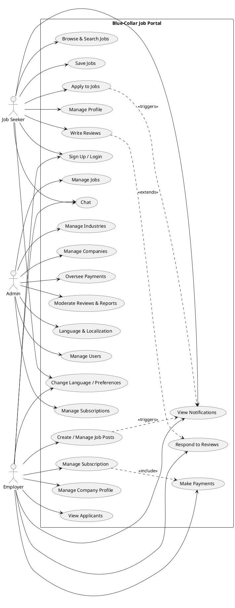

# Use Case Diagram and Roles

This document summarizes the main use cases in the Blue‑Collar Job Portal and provides a diagram source you can render.

## Actors
- Job Seeker
- Employer
- Admin

## Key Use Cases

### Job Seeker
- Sign up / Login
- Browse and search jobs
- Save jobs
- Apply to jobs
- Chat with employers
- Manage profile and preferences
- View notifications
- Write reviews
- Change language

### Employer
- Sign up / Login
- Create and manage job posts
- Manage company profile
- View applicants
- Chat with job seekers
- Manage subscription and make payments
- Respond to reviews
- View notifications
- Change language

### Admin
- Manage users, jobs, companies, industries
- Moderate reviews and handle reports/appeals
- Manage subscriptions and oversee payments
- Language and localization administration

## Diagram Source (PlantUML)

The diagram is in `docs/use-case-diagram.puml`. You can render it using any PlantUML tool or VS Code extension.

## Rendering Options
- VS Code: install "PlantUML" extension, open `docs/use-case-diagram.puml`, and preview.
- Online: paste the contents into https://www.plantuml.com/plantuml/.
- CLI: use `java -jar plantuml.jar docs/use-case-diagram.puml` to generate an image.

